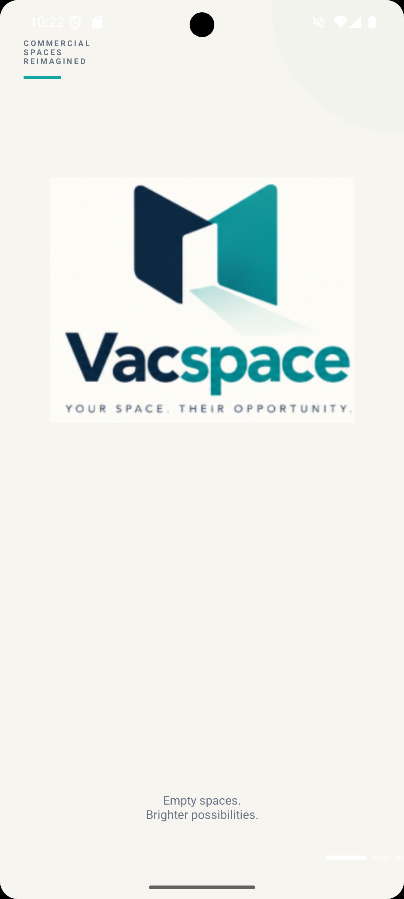
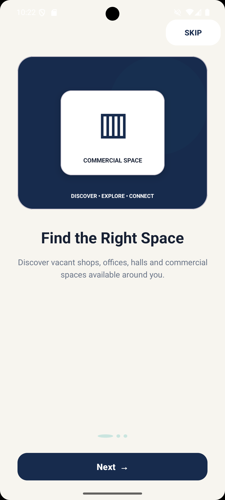
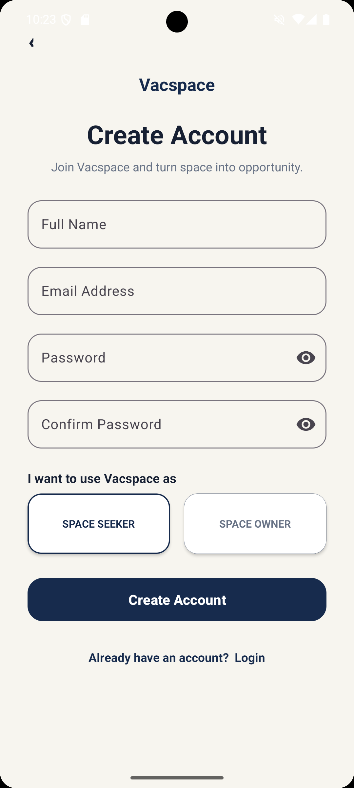
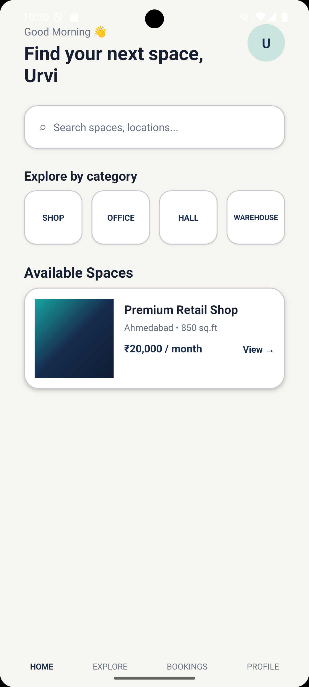
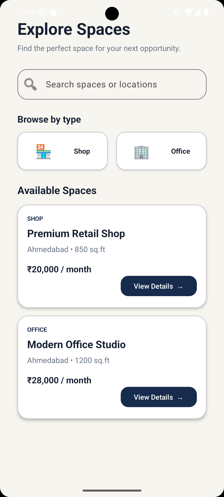
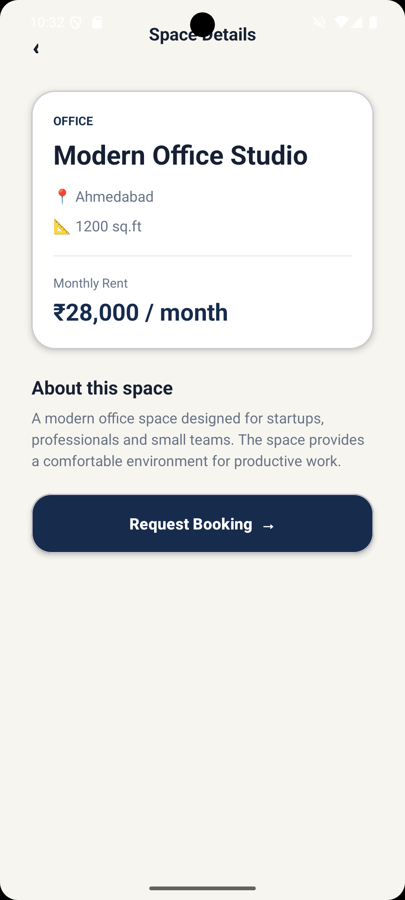
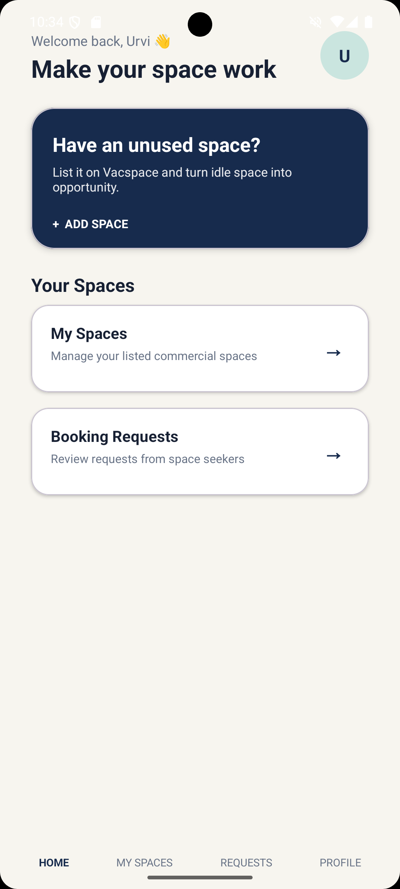
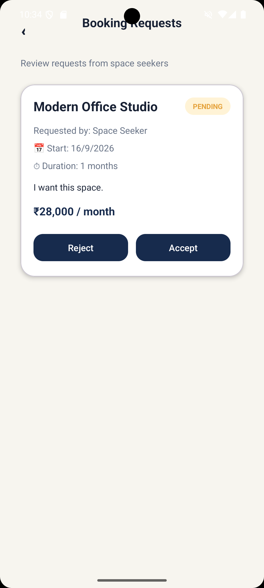

# Vacspace: Unused Commercial Space for Monetization

## AIM & Objective

To develop an Android application that helps commercial space owners monetize their unused spaces by connecting them with people looking for suitable spaces for their business needs.

The application provides a structured platform where space owners can list their unused commercial spaces and space seekers can discover, view, and request bookings for suitable spaces.

---

# Project Overview

Vacspace is an Android-based application designed to help monetize unused commercial spaces.

The application provides two types of users:

- Space Seeker
- Space Owner

The application allows users to:

- Create an account
- Select a user role
- Login to the application
- Explore available commercial spaces
- Search for suitable spaces
- Browse spaces by category
- View detailed space information
- Request a booking
- View booking information and status
- Add unused commercial spaces
- View listed spaces
- Manage booking requests
- Accept or reject booking requests
- View profile details
- Logout from the application

---

# Main Features

## 1. Account Management

- User Registration
- Space Seeker and Space Owner role selection
- Login Authentication
- Account-specific user information
- Profile Details
- Logout Functionality

---

## 2. Unused Commercial Space Listing

Space Owners can list their unused commercial spaces for potential monetization.

Each space contains:

- Space Name
- Space Type
- Location
- Area
- Monthly Price
- Description

Space Owners can add their available spaces through the Add Space section.

---

## 3. Space Discovery

Space Seekers can discover available commercial spaces through the Explore section.

Users can:

- Browse available spaces
- Search for spaces
- Select space categories
- View space name
- View space type
- View location
- View area
- View monthly price

Available categories include:

- Shop
- Office

---

## 4. Space Details

Space Seekers can view detailed information about a selected commercial space.

The Space Details screen displays:

- Space Name
- Space Type
- Location
- Area
- Monthly Price
- Description

The seeker can request a booking directly from the Space Details screen.

---

## 5. Booking

Space Seekers can submit a booking request for an available commercial space.

The booking request contains:

- Space Name
- Location
- Area
- Monthly Price
- Start Date
- Booking Duration
- Message

The start date is selected using Android DatePickerDialog.

---

## 6. My Bookings

Space Seekers can view their submitted booking information.

The booking section displays:

- Space Name
- Location
- Start Date
- Booking Duration
- Monthly Price
- Booking Status

The booking status can be:

- PENDING
- ACCEPTED
- REJECTED

---

## 7. My Spaces

Space Owners can view their listed commercial spaces.

The section displays:

- Space Name
- Space Type
- Location
- Area
- Monthly Price

---

## 8. Booking Requests

Space Owners can view booking requests submitted by Space Seekers.

The owner can:

- View requested space
- View booking details
- View start date
- View booking duration
- View message
- View monthly price
- Accept a booking request
- Reject a booking request

The booking status is updated according to the owner's decision.

---

## 9. Profile

The Profile section displays the logged-in user's:

- Name
- Email
- User Role

The user can also logout from the application.

---

# Booking Status

| Status | Meaning |
|---|---|
| PENDING | Booking request has been submitted and is waiting for owner action |
| ACCEPTED | Owner has accepted the booking request |
| REJECTED | Owner has rejected the booking request |

---

# Output Screenshots

| Splash Screen | Onboarding Screen |
|:---:|:---:|
|  |  |

| Register Screen |
|:---:|
|  |

| Seeker Home | Explore Spaces |
|:---:|:---:|
|  |  |

| Space Details |
|:---:|
|  |

| Owner Home | Booking Requests |
|:---:|:---:|
|  |  |

---

# Technology Used

| Technology | Purpose |
|---|---|
| Kotlin | Android application development |
| XML | User interface design |
| ConstraintLayout | Responsive screen layouts |
| Material Components | Modern UI components |
| SharedPreferences | Local data storage |
| Android Activities | Application screens |
| Intent | Navigation between activities |
| DatePickerDialog | Selecting booking start date |
| Toast | Displaying user feedback messages |
| ViewFlipper | Implementing onboarding screens |
| Android Studio | Application development |
| Git and GitHub | Version control |

---

# UI Implementation Details

- **Application Type:** Android Application
- **Programming Language:** Kotlin
- **UI Technology:** XML
- **Layout:** ConstraintLayout
- **UI Components:** Material Components
- **Navigation:** Android Intent
- **Data Storage:** SharedPreferences
- **Date Selection:** DatePickerDialog
- **Onboarding:** ViewFlipper
- **Application Theme:** Material-based UI
- **User Roles:** Space Seeker and Space Owner
- **Booking Status:** PENDING, ACCEPTED and REJECTED

---

# Application Working

## 1. Registration

The user creates an account by entering:

- Full Name
- Email
- Password
- Confirm Password

The user can select one of two roles:

- Space Seeker
- Space Owner

The account information and selected role are stored locally using SharedPreferences.

---

## 2. Login

The user enters their registered email and password.

If the details are correct, the application checks the stored user role.

The user is redirected to the appropriate dashboard:

- Space Seeker → Seeker Home
- Space Owner → Owner Home

---

## 3. Seeker Home

The Seeker Home screen provides access to:

- Space Search
- Commercial Space Categories
- Available Spaces
- Explore
- My Bookings
- Profile

The seeker can select a space to view its details.

---

## 4. Exploring Spaces

The Explore section displays available commercial spaces.

The seeker can:

- Search for a space
- Select a category
- View available spaces
- Open the details of a selected space

The search functionality allows users to find spaces based on relevant information such as:

- Space Name
- Space Type
- Location

---

## 5. Viewing Space Details

After selecting a space, the Space Details screen displays:

- Space Type
- Space Name
- Location
- Area
- Monthly Price
- Description

The seeker can select the Request Booking button to continue with the booking process.

---

## 6. Requesting a Booking

The seeker selects a start date using DatePickerDialog.

The seeker then enters:

- Booking Duration
- Message

After validation, the booking request is stored locally with the initial status:

```text
PENDING
```

A confirmation message is displayed after successfully submitting the request.

---

## 7. Managing Booking Requests

The Space Owner can open the Booking Requests section to view submitted requests.

The owner can choose:

- Accept
- Reject

If accepted:

```text
PENDING → ACCEPTED
```

If rejected:

```text
PENDING → REJECTED
```

The updated status is reflected in the booking information.

---

## 8. Adding an Unused Commercial Space

The Space Owner can add an unused commercial space by entering:

- Space Name
- Space Type
- Location
- Area
- Monthly Price
- Description

After successful validation, the space is stored locally.

A confirmation message is displayed after successful listing.

---

## 9. My Spaces

The My Spaces section displays the commercial space added by the owner.

The stored space information includes:

- Space Name
- Space Type
- Location
- Area
- Monthly Price

---

## 10. My Bookings

The My Bookings section allows Space Seekers to view their submitted booking requests.

The seeker can check:

- Requested Space
- Location
- Start Date
- Duration
- Monthly Price
- Booking Status

---

## 11. Profile

The Profile section displays the logged-in user's:

- Name
- Email
- User Role

The user can logout from the application.

After logout, the user is redirected to the Login screen.

---

# Validation

The application performs basic validation for important user inputs.

Examples include:

- Empty name validation
- Empty email validation
- Empty password validation
- Minimum password length validation
- Confirm password validation
- Empty space details validation
- Empty booking details validation

Error messages are displayed using input field errors and Toast messages.

---

# Data Storage

The current prototype uses Android SharedPreferences for storing application data locally.

The application stores:

- User registration details
- User role
- Space details
- Booking details
- Booking status

The following SharedPreferences keys are used:

```text
VacspaceUser
VacspaceSpace
VacspaceBooking
```

### Prototype Limitation

The current application stores data locally on the device.

It does not provide cloud synchronization between different devices.

A production version can use a secure backend and cloud database for multi-user data management.

---

# Project Structure

```text
Vacspace/
│
├── app/
│   └── src/
│       └── main/
│           ├── java/com/example/vacspace/
│           │   ├── MainActivity.kt
│           │   ├── OnboardingActivity.kt
│           │   ├── LoginActivity.kt
│           │   ├── RegisterActivity.kt
│           │   ├── SeekerHomeActivity.kt
│           │   ├── OwnerHomeActivity.kt
│           │   ├── ExploreActivity.kt
│           │   ├── SpaceDetailsActivity.kt
│           │   ├── BookingActivity.kt
│           │   ├── MyBookingsActivity.kt
│           │   ├── AddSpaceActivity.kt
│           │   ├── MySpacesActivity.kt
│           │   ├── BookingRequestsActivity.kt
│           │   └── ProfileActivity.kt
│           │
│           ├── res/
│           │   ├── layout/
│           │   │   ├── activity_main.xml
│           │   │   ├── activity_onboarding.xml
│           │   │   ├── activity_login.xml
│           │   │   ├── activity_register.xml
│           │   │   ├── activity_seeker_home.xml
│           │   │   ├── activity_owner_home.xml
│           │   │   ├── activity_explore.xml
│           │   │   ├── activity_space_details.xml
│           │   │   ├── activity_booking.xml
│           │   │   ├── activity_my_bookings.xml
│           │   │   ├── activity_add_space.xml
│           │   │   ├── activity_my_spaces.xml
│           │   │   ├── activity_booking_requests.xml
│           │   │   └── activity_profile.xml
│           │   │
│           │   ├── drawable/
│           │   │   ├── img.png
│           │   │   ├── bg_splash.xml
│           │   │   ├── bg_splash_circle.xml
│           │   │   ├── bg_progress_active.xml
│           │   │   ├── bg_progress_inactive.xml
│           │   │   └── bg_status_pending.xml
│           │   │
│           │   └── values/
│           │       ├── colors.xml
│           │       └── themes.xml
│           │
│           └── AndroidManifest.xml
│
├── screenshots/
│   ├── splash.png
│   ├── onboarding.png
│   ├── register.png
│   ├── seeker_home.png
│   ├── explore.png
│   ├── space_details.png
│   ├── owner_home.png
│   └── booking_requests.png
│
├── README.md
└── .gitignore
```

---

# Future Scope

The application can be further enhanced with:

- Firebase or cloud database integration
- Online payment integration
- Google Maps integration
- Image upload for commercial spaces
- Real-time booking notifications
- In-app chat between seekers and owners
- Reviews and ratings
- Advanced filtering and sorting
- Multiple space listings per owner
- Admin dashboard
- Secure backend authentication

---

# Conclusion

Vacspace provides a simple platform for monetizing unused commercial spaces by connecting space owners with people looking for suitable spaces.

The application allows Space Owners to list their unused commercial spaces and manage booking requests, while Space Seekers can discover spaces, view details and request bookings.

The project demonstrates important Android development concepts including Activities, Intents, XML layouts, ConstraintLayout, Material Components, SharedPreferences, input validation, ViewFlipper, Toast messages and DatePickerDialog.

Vacspace focuses on converting unused commercial spaces into potential income-generating opportunities while making it easier for seekers to discover suitable spaces.